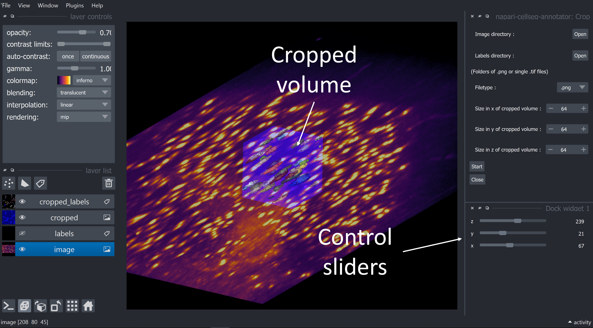

.. _cropping_module_guide:

Cropping module guide
=================================

This module allows you to crop your volumes and labels dynamically,
by selecting a fixed size volume and moving it around the image.

You can then save the cropped volume and labels directly using napari,
by selecting the layer and then using **File -> Save selected layer**,
or simply **CTRL+S** once you have selected the correct layer.

Launching the review process
---------------------------------

First, you will be asked to provide a volume folder and a label folder, as well as the file extension
of your images (either .png or .tif).

.. important::
    Depending on the filetype you selected, the folders should either contain:

    * For .png, one png per slice (provide a folder of several pngs)
    * For .tif, a folder containing a **single** **3D** tif file with all slices (if there are several, the first one will be used)

You can the choose the size of the cropped volume, which will be fixed throughout the process.
Support for dynamically changing the crop size might be added in the future.

Once you are ready, you can press **Start** to start the review process.

Cropping process : interface & functionalities
---------------------------------------------------------------

Once you have launched the review process, you will have access to three sliders that will let
you **change the position** of the cropped volumes and labels in the x,y and z positions.

.. hint::
    If you **cannot see your cropped volume well**, feel free to change the **colormaps** of the image and the cropped
    volume to better see them.
    You may want to change the **opacity** and **contrast values** depending on your image, too.

.. note::
    When you are done you can save the cropped volume and labels directly using napari,
    by selecting the layer and then using **File -> Save selected layer**,
    or simply **CTRL+S** once you have selected the correct layer.

Source code
-------------------------------------------------

* :doc:`plugin_crop`
