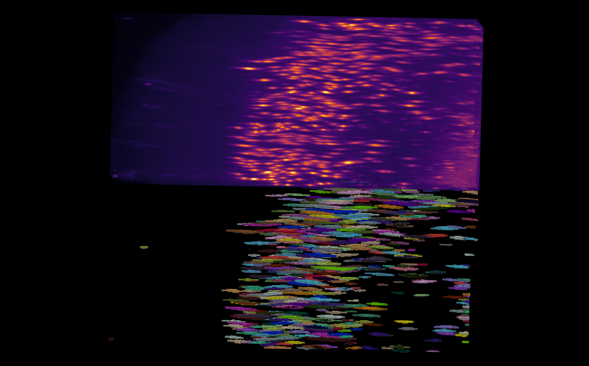
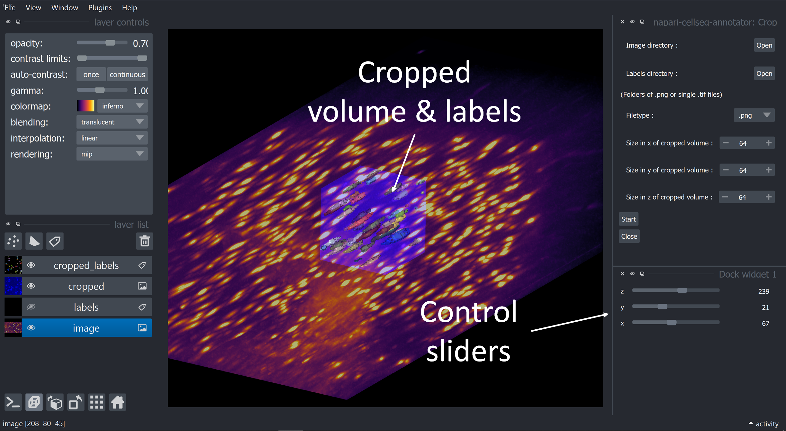
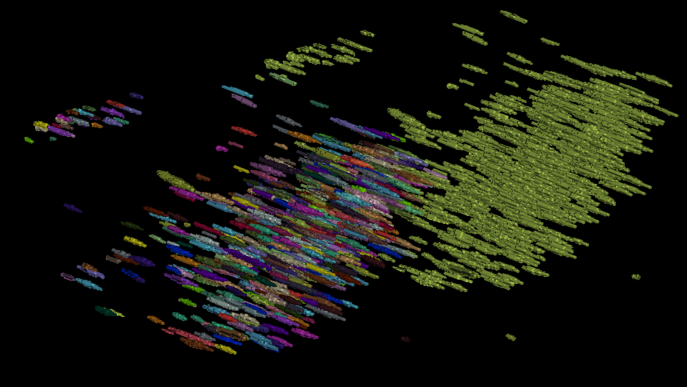
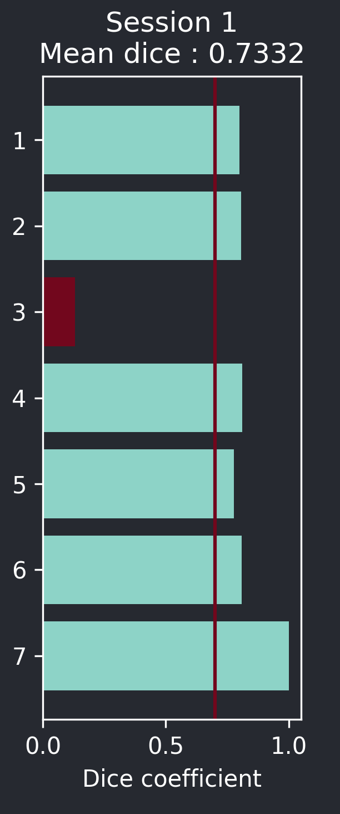
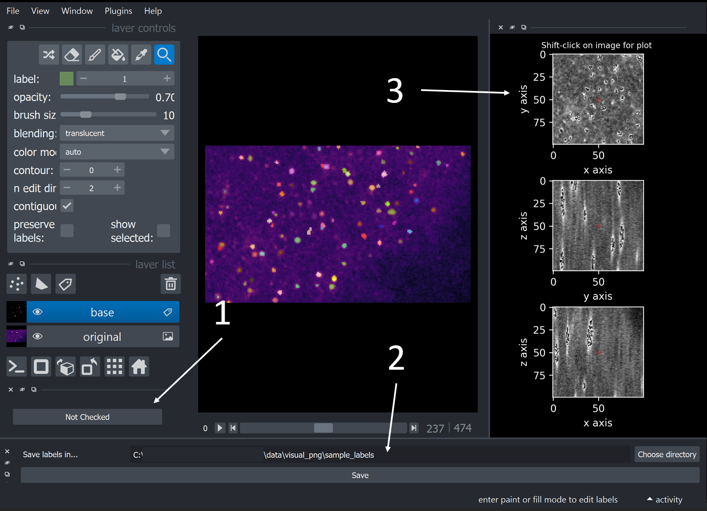
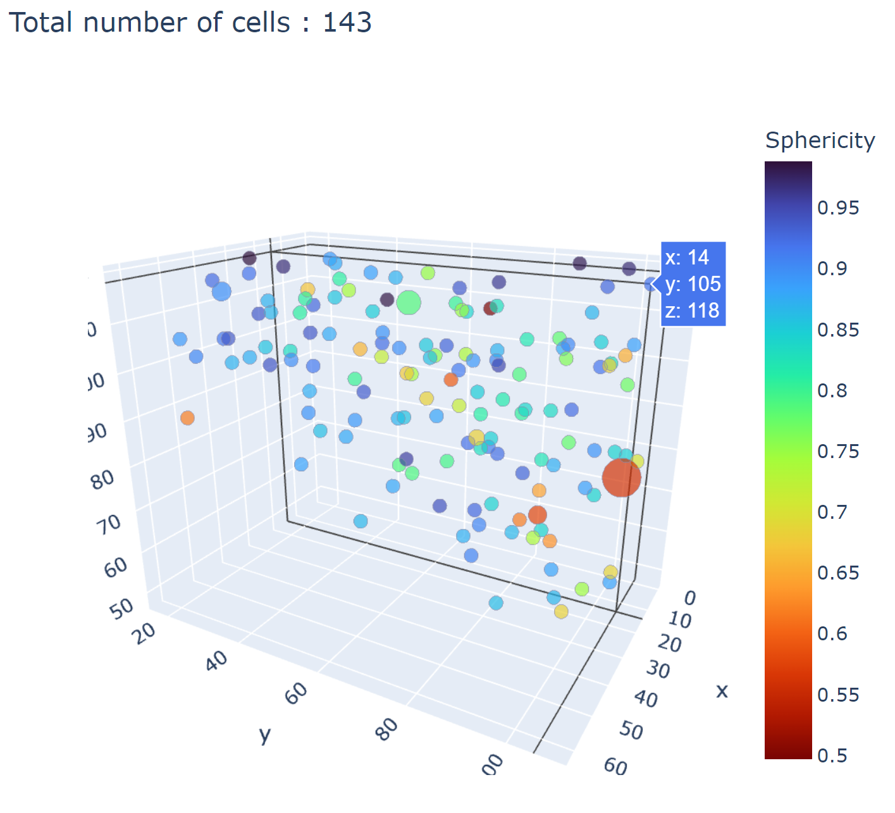

.. _detailed_walkthrough:

Detailed walkthrough - Supervised learning
===================================================

The following guide will show you how to use the plugin's workflow, starting from human-labeled annotation volume, to running inference on novel volumes.

Preparing images and labels
-------------------------------

CellSeg3D was designed for cleared-brain tissue data (collected on mesoSPIM ligthsheet systems). Specifically, we provide a series
of deep learning models that we have found to work well on cortical whole-neuron data. We also provide support for MONAI models, and
we have ported TRAILMAP to PyTorch and trained the model on mesoSPIM collected data. We provide all the tooling for you to use these
weights and also perform transfer learning by fine-tuning the model(s) on your data for even better performance!

To get started with the entire workflow (i.e., fine-tuning on your data), you'll need at least one pair of image and corresponding labels;
let's assume you have part of a cleared brain from mesoSPIM imaging as a large .tif file.

If you want to test the models "as is", please see "Inference" sections in our docs.

   Example of an anisotropic volume (i.e., often times the z resolution is not the same as x and y) and its associated labels.

.. note::
    The approach here will be human-in-the-loop review of labels.
    If you need to label your volumes from scratch,
    or initially correct labels, please read the Review section right after Cropping.

Cropping
*****************

To reduce memory requirements and build a dataset from a single, large volume,
you can use the **cropping** tool to extract multiple smaller images from a large volume for training.

Simply load your image and labels (by checking the "Crop labels simultaneously" option),
and select the volume size you desire to use.

.. note::
    The best way to choose the size when cropping images you intend to use for training models is to use
    cubic images sized with a power of two : the default :math:`64^3` should be a good start if you're unsure.
    Stick to the same size for a given dataset.
    If you simply want to isolate specific regions with variable sizes, you can still compensate for it in training though.
    You may also use different image sizes for inference, simply ensure that images in a folder are of a similar size if you
    wish to run inference on all of them.

You can now use the sliders to choose the regions you want to extract,
then either quicksave the results or select the layer you'd like to save and use **CTRL+S** to save it
(useful if you want to name the results or change the file extension).

   Cropping module layout

Label conversion : convert utility
*************************************

Assuming you have instance labels, you'll need to convert them to semantic labels before using them for training.
To this end, you can use the folder conversion functions in the *Convert* tab of Utilities :
choose your output directory for the results, select the folder containing your cropped volumes in the *Convert folder*
section, and click on **"Convert to semantic labels"**.

   Example of instance labels from above converted to semantic labels

If you wish to remove small objects, or convert a single image, you can open a single image with **CTRL+O**
and, after selecting the corresponding layer on the left, use the layer-related buttons to perform
your operations.

Models for object detection
-----------------------------------------------------------

Training
*****************

If you have a dataset of reasonably sized images (see cropping above) with semantic labels, you're all set to proceed!
First, load your data by inputting the paths to images and labels, as well as where you want the results to be saved.

There are a few more options on this tab:

* Transfer weights : you can start the model with our pre-trained weights if your dataset comes from cleared brain tissue
  imaged by a mesoSPIM (or other lightsheet). If you have your own weights for the provided models, you can also choose to load them by
  checking the related option; simply make sure they are compatible with the model you selected.

  To import your own model, see : :ref:`custom_model_guide`, please note this is still a WIP.

* Validation proportion : the percentage is listed is how many images will be used for training versus validation.
  Validation can work with as little as one image, however performance will greatly improve the more images there are.
  Use 90% only if you have a very small dataset (less than 5 images).

* Save as zip : simply copies the results in a zip archive for easier transfer.

Now, we can switch to the next tab : data augmentation.

If you have cropped cubic images with a power of two as the edge length, you do not need to extract patches,
your images are usable as is.
However, if you are using larger images or with dissimilar sizes,
you can use this option to auto-extract smaller patches that will be automatically padded back to a power
of two no matter the size you choose. For optimal performance, make sure to use a value close or equal to
a power of two still, such as 64 or 120.

.. important::
    Using a too large value for the size will cause memory issues. If this happens, restart the worker with smaller volumes.

You also have the option to use data augmentation, which can improve performance and generalization.
In most cases this should left enabled.

Finally, the last tab lets you choose :

* The models

    * SegResNet is a lightweight model (low memory requirements) from MONAI originally designed for 3D fMRI data.
    * VNet is a larger (than SegResNet) CNN from MONAI designed for medical image segmentation.
    * TRAILMAP_MS is our implementation in PyTorch additionally trained on mouse cortical neural nuclei from mesoSPIM data.
    * SwinUNetR is a MONAI implementation of the SwinUNetR model. It is costly in compute and memory, but can achieve high performance.
    * WNet is our reimplementation of an unsupervised model, which can be used to produce segmentation without labels.

* The loss : for object detection in 3D volumes you'll likely want to use the Dice or Dice-focal Loss.

* Batch size : chose a value that fits your available memory. If you want to avoid memory issues due to the batch size,
  leave it on one.

* Learning rate : if you are not using pre-trained weights or loading your own custom ones, try with 1e-3. Use smaller values
  if you are using custom/pre-trained weights.

* Number of epochs : The larger the value, the longer the training will take, but performance might improve with longer
  training.  You could start with 40, and see if the loss decreases while the validation metric rises.

.. note::
    During training, you can monitor the process using the plots : the one on the right (validation) should increase
    whereas the loss should decrease. If the validation starts lowering after reaching a maximum, but the loss still decreases,
    it could indicate over-fitting, which will negatively impact generalization for the given weights.
    You might want use weights generated from the epoch with the maximum validation score if that is the case.

.. figure:: ../images/plots_train.png
   :align: center

   Plots displayed by the training module after 40 epochs

* Validation interval : if the value is e.g. 2, the training will stop every 2 epochs to perform validation (check performance)
  and save the results if the score is better than previously. A larger value will accelerate training, but might cause the saving to miss
  better scores. Reasonably, start with 1 for short training sessions (less than 10 epochs) and increase it to two or three if you are training
  for 20-60 epochs.

* Deterministic training : if you wish for the training to have reproducibility, enable this and remember the seed you use.
  Using the same seed with the same model, images, and parameters should consistently yield similar results. See `MONAI deterministic training`_.

.. _MONAI deterministic training: https://docs.monai.io/en/stable/utils.html#module-monai.utils.misc

Once all these parameters are set, you can start the training. You can monitor the progress with the plots; should you want to stop
the training you can do so anytime  by pressing the Start button again, whose text should change to **Click to stop**.

In the results folder, you will have access to the weights from training (**.pth** files),
which you can then use in inference.

Inference
*************

To start, simply choose which folder of images you'd like to run inference on, then the folder in which you'd like the results to be.

Then, select the model you trained (see note below for SegResNet), and load your weights from training.

.. note::
    If you already trained a SegResNet, set the counter below the model choice to the size of the images you trained the model on.
    (Either use the size of the image itself if you did not extract patches, or the size of the nearest superior power of two of the patches you extracted)

    Example :

    * If you used :math:`64^3` whole volumes to train the model, enter :math:`64` in the counter.
    * If you extracted :math:`120^3` patches from larger images, enter :math:`128`

Next, you can choose to use window inference, use this if you have very large images.
Please note that using too small of a window might degrade performance, set the size appropriately.

You can also keep the dataset on the CPU to reduce memory usage, but this might slow down the inference process.

If you have anisotropic volumes, you can compensate for it by entering the resolution of your microscope.

By default, inference will calculate and display probability maps (values between 0 and 1).

If you'd like to have semantic labels (only 0 and 1) rather than a probability map, set the thresholding to the desired probability.

If instead you'd prefer to have instance labels, you can enable instance segmentation and select :

* The method

    * Connected components : all separated items with a value above the threshold will be labeled as an instance
    * Watershed : objects will be assigned an ID by using the gradient probability at the center of each (set the threshold to a decently high probability for best results).

* The threshold : Objects above this threshold will be retained as single instances.

* Small object removal : Use this to remove small artifacts; all objects below this volume in pixels will be removed.

Using instance segmentation, you can also analyze the results by checking the *Save stats to CSV* option.

This will compute :

* The volume of each cell in pixels
* The centroid coordinates in :math:`X,Y,Z`
* The sphericity of each cell
* The original size of the image
* The total volume in pixels
* The total volume occupied by objects
* The ratio of :math:`\frac {Volume_{label}} {Volume_{total}}`
* The total number of unique object instance

If you wish to see some of the results, you can leave the *View results in napari* option checked.

.. note::
    If you'd like some of these results to be plotted for you, check out the `provided notebooks`_

.. _provided notebooks: https://github.com/AdaptiveMotorControlLab/CellSeg3d/tree/main/notebooks

You can then launch inference and the results will be saved to your specified folder.

.. figure:::: ../image/inference_results_example.png

   Example of results from inference with original volumes, as well as semantic and instance predictions.

   Dice metric score plot

Scoring, review, analysis
----------------------------

.. Using the metrics utility module, you can compare the model's predictions to any ground truth labels you might have.
    Simply provide your prediction and ground truth labels, and compute the results.
    A Dice metric of 1 indicates perfect matching, whereas a score of 0 indicates complete mismatch.
    Select which score **you consider as sub-optimal**, and all results below this will be **shown in napari**.
    If at any time the **orientation of your prediction labels changed compared to the ground truth**, check the
    "Find best orientation" option to compensate for it.

Labels review
************************

Using the review module, you can correct the predictions from the model.
Simply load your images and labels, enter the name of the CSV (to keep track of the review process, it will
record which slices have been checked or not and the time taken).

See the `napari tutorial on annotation`_ for instruction on correcting and adding labels.

.. _napari tutorial on annotation: https://napari.org/howtos/layers/labels.html#selecting-a-label

If you wish to see the surroundings of an object to ensure it should be labeled,
you can use **Shift+Click** on the location you wish to see; this will plot
the  surroundings of the selected location for easier viewing.

   Layout of the review module

Once you are done with the review of a slice, press the "Not checked" button to switch the status to
"Checked" and save the time taken in the csv file.

Finally, when you are done, press the *Save* button to record your work.

Analysis : Jupyter notebooks
*********************************

In the `notebooks folder of the repository`_, you can find notebooks you can use directly to plot
labels (full_plot.ipynb) or notebooks for plotting the results from your inference csv with object stats (csv_cell_plot.ipynb).

Simply enter your folder or csv file path and the notebooks will plot your results.
Make sure you have all required libraries installed and jupyter extensions set up as explained
for the plots to work.

   Example of the plot present in the notebooks.
   Coordinates are based on centroids, the size represents the volume, the color the sphericity.

.. _notebooks folder of the repository: https://github.com/AdaptiveMotorControlLab/CellSeg3d/tree/main/notebooks

With this complete, you can repeat the workflow as needed.
