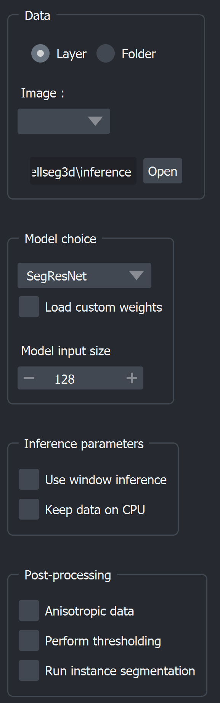
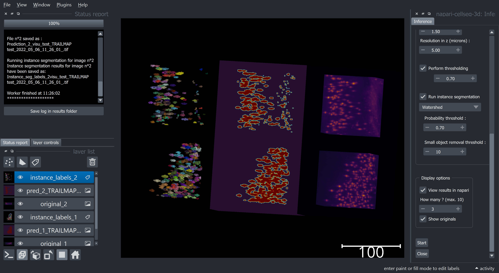

.. _inference_module_guide:

Inference module guide
=================================

This module allows you to use pre-trained segmentation algorithms (written in Pytorch) on 3D volumes
to automatically label cells.

.. important::
    Currently, only inference on **3D volumes is supported**. Your image and label folders should both contain a set of
    **3D image files**, currently either **.tif** or **.tiff**.

Currently, the following pre-trained models are available :

==============   ================================================================================================
Model            Link to original paper
==============   ================================================================================================
VNet             `Fully Convolutional Neural Networks for Volumetric Medical Image Segmentation`_
SegResNet        `3D MRI brain tumor segmentation using autoencoder regularization`_
TRAILMAP_MS       A PyTorch implementation of the `TRAILMAP project on GitHub`_ pretrained with mesoSPIM data
TRAILMAP          An implementation of the `TRAILMAP project on GitHub`_ using a `3DUNet for PyTorch`_
SwinUNetR         `Swin Transformers for Semantic Segmentation of Brain Tumors in MRI Images`_
==============   ================================================================================================

.. _Fully Convolutional Neural Networks for Volumetric Medical Image Segmentation: https://arxiv.org/pdf/1606.04797.pdf
.. _3D MRI brain tumor segmentation using autoencoder regularization: https://arxiv.org/pdf/1810.11654.pdf
.. _TRAILMAP project on GitHub: https://github.com/AlbertPun/TRAILMAP
.. _3DUnet for Pytorch: https://github.com/wolny/pytorch-3dunet
.. _Swin Transformers for Semantic Segmentation of Brain Tumors in MRI Images: https://arxiv.org/abs/2201.01266

Interface and functionalities
--------------------------------

* **Loading data** :

  | When launching the module, you will be asked to provide an **image layer** or an **image folder** with the 3D volumes you'd like to be labeled.
  | If loading from folder : All images with the chosen extension (**.tif** or **.tiff** currently supported) in this folder will be labeled.
  | You can then choose an **output folder**, where all the results will be saved.

* **Model choice** :

  | You can then choose one of the provided **models** above, which will be used for inference.
  | You may also choose to **load custom weights** rather than the pre-trained ones, simply ensure they are **compatible** (e.g. produced from the training module for the same model)
  | If you choose to use SegResNet or SwinUNetR with custom weights, you will have to provide the size of images it was trained on to ensure compatibility. (See note below)

.. note::
    Currently the SegResNet and SwinUNetR models requires you to provide the size of the images the model was trained with.
    Provided weights use a size of 128, please leave it on the default value if you're not using custom weights.

* **Inference parameters** :

  | You can choose to use inference on the whole image at once, which generally yields better performance at the cost of more memory, or you can use a specific window size to run inference on smaller chunks one by one, for lower memory usage.
  | You can also choose to keep the dataset in the RAM rather than the VRAM (cpu vs cuda device) to avoid running out of VRAM if you have several images.

* **Anisotropy** :

  | If you want to see your results without **anisotropy** when you have anisotropic images, you can specify that you have anisotropic data and set the **resolution of your imaging method in micron**, this wil save and show the results without anisotropy.

* **Thresholding** :

  | You can perform thresholding to **binarize your labels**,
  | all values beneath the **confidence threshold** will be set to 0 using this.

* **Instance segmentation** :

  | You can convert the semantic segmentation into instance labels by using either the `watershed`_ or `connected components`_ method.
  | You can set the probability threshold from which a pixel is considered as a valid instance, as well as the minimum size in pixels for objects. All smaller objects will be removed.
  | Instance labels will be saved (and shown if applicable) separately from other results.

.. _watershed: https://scikit-image.org/docs/dev/auto_examples/segmentation/plot_watershed.html
.. _connected components: https://scikit-image.org/docs/dev/api/skimage.measure.html#skimage.measure.label

* **Computing objects statistics** :

    You can choose to compute various stats from the labels and save them to a csv for later use.

    This includes, for each object :

    * Object volume (pixels)
    * :math:`X,Y,Z` coordinates of the centroid
    * Sphericity

    And more general statistics :

    * Image size
    * Total image volume (pixels)
    * Total object (labeled) volume (pixels)
    * Filling ratio (fraction of the volume that is labeled)
    * The number of labeled objects

    In the ``notebooks`` folder you can find an example of plotting cell statistics using the result csv.

* **Viewing results** :

  | You can also select whether you'd like to **see the results** in napari afterwards.
  | By default the first image processed will be displayed, but you can choose to display up to **ten at once**.
  | You can also request to see the originals.

When you are done choosing your parameters, you can press the **Start** button to begin the inference process.
Once it has finished, results will be saved then displayed in napari; each output will be paired with its original.
On the left side, a progress bar and a log will keep you informed on the process.

.. note::
    | The files will be saved using the following format :
    |    ``{original_name}_{model}_{date & time}_pred{id}.file_ext``
    | For example, using a VNet on the third image of a folder, called "somatomotor.tif" will yield the following name :
    |   *somatomotor_VNet_2022_04_06_15_49_42_pred3.tif*
    | Instance labels will have the "Instance_seg" prefix appened to the name.

.. hint::
    | **Results** will be displayed using the **twilight shifted** colormap if raw or **turbo** if thresholding has been applied, whereas the **original** image will be shown in the **inferno** colormap.
    | Feel free to change the **colormap** or **contrast** when viewing results to ensure you can properly see the labels.
    | You'll most likely want to use **3D view** and **grid mode** in napari when checking results more broadly.

.. note::
    You can save the log after the worker is finished to easily remember which parameters you ran inference with.

Source code
--------------------------------
* :doc:`../code/plugin_model_inference`
* :doc:`../code/model_framework`
* :doc:`../code/model_workers`
