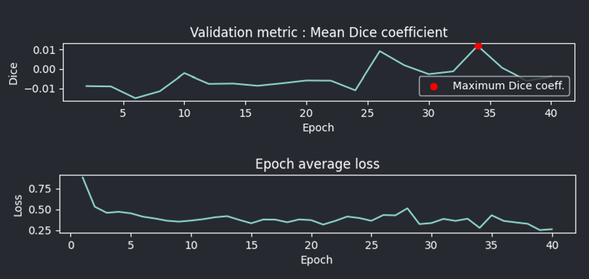

.. _training_module_guide:

Training module guide
=================================

This module allows you to train pre-defined Pytorch models for cell segmentation.
Pre-defined models are stored in napari-cellseg-3d/models.

.. important::
    Currently, only inference on **3D volumes is supported**. Your image and label folders should both contain a set of
    **3D image files**, currently either **.tif** or **.tiff**. Loading a folder of 2D images as a stack is not supported as of yet.

Currently, the following pre-defined models are available :

==============   ================================================================================================
Model            Link to original paper
==============   ================================================================================================
VNet             `Fully Convolutional Neural Networks for Volumetric Medical Image Segmentation`_
SegResNet        `3D MRI brain tumor segmentation using autoencoder regularization`_
TRAILMAP_MS       A PyTorch implementation of the `TRAILMAP project on GitHub`_ pretrained with MesoSpim data
TRAILMAP          An implementation of the `TRAILMAP project on GitHub`_ using a `3DUNet for PyTorch`_
==============   ================================================================================================

.. _Fully Convolutional Neural Networks for Volumetric Medical Image Segmentation: https://arxiv.org/pdf/1606.04797.pdf
.. _3D MRI brain tumor segmentation using autoencoder regularization: https://arxiv.org/pdf/1810.11654.pdf
.. _TRAILMAP project on GitHub: https://github.com/AlbertPun/TRAILMAP
.. _3DUnet for Pytorch: https://github.com/wolny/pytorch-3dunet

.. important::
    | The machine learning models used by this program require all images of a dataset to be of the same size.
    | Please ensure that all the images you are loading are of the **same size**, or to use the **"extract patches" (in augmentation tab)** with an appropriately small size to ensure all images being used by the model are of a workable size.

The training module is comprised of several tabs.

1) The first one, **Data**, will let you set :

* The path to the images folder (3D image files)
* The path to the labels folder (3D image files)
* The path to the results folder

* Whether to copy results to a zip file (for easier transferability)

* Whether to use pre-trained weights that are provided; if you choose to do so, the model will be initialized with the specified weights, possibly improving performance (transfer learning).
  You can also load custom weights; simply ensure they are compatible with the model.

* The proportion of the dataset to keep for training versus validation; if you have a large dataset, you can set it to a lower value to have more accurate validation steps.

2) The second tab, **Augmentation**, lets you define dataset and augmentation parameters such as :

* Whether to use images "as is" (**requires all images to be of the same size and cubic**) or extract patches.

.. important::
    | **All image sizes used should be as close to a power of two as possible, or equal to a power of two.**
    | Images are automatically padded; a 64 pixels cube will be used as is, but a 65 pixel cube will be padded up to 128 pixels, resulting in much higher memory use.

* If you're extracting patches :

    * The size of patches to be extracted (ideally, please use a value **close or equal to a power of two**, such as 120 or 60 to ensure correct size. See above note.)
    * The number of samples to extract from each of your images. A larger number will likely mean better performances, but longer training and larger memory usage.

* Whether to perform data augmentation or not (elastic deforms, intensity shifts. random flipping,etc).
  Ideally it should always be enabled, but you can disable it if it causes issues.

3) The third contains training related parameters :

* The **model** to use for training (see table above)
* The **loss function** used for training (see table below)
* The **learning rate** of the optimizer. Setting it to a lower value if you're using pre-trained weights can improve performance.
* The **batch size** (larger means quicker training and possibly better performance but increased memory usage)
* The **number of epochs** (a possibility is to start with 60 epochs, and decrease or increase depending on performance.)
* The **epoch interval** for validation (for example, if set to two, the module will use the validation dataset to evaluate the model with the dice metric every two epochs.)

.. note::
    If the dice metric is better on a given validation interval, the model weights will be saved in the results folder.

The available loss functions are :

========================  ================================================================================================
Function                  Reference
========================  ================================================================================================
Dice loss                 `Dice Loss from MONAI`_ with ``sigmoid=true``
Focal loss                `Focal Loss from MONAI`_
Dice-Focal loss           `Dice-focal Loss from MONAI`_ with ``sigmoid=true`` and ``lambda_dice = 0.5``
Generalized Dice loss     `Generalized dice Loss from MONAI`_ with ``sigmoid=true``
Dice-CE loss              `Dice-CE Loss from MONAI`_ with ``sigmoid=true``
Tversky loss              `Tversky Loss from MONAI`_ with ``sigmoid=true``
========================  ================================================================================================

.. _Dice Loss from MONAI: https://docs.monai.io/en/stable/losses.html#diceloss
.. _Focal Loss from MONAI: https://docs.monai.io/en/stable/losses.html#focalloss
.. _Dice-focal Loss from MONAI: https://docs.monai.io/en/stable/losses.html#dicefocalloss
.. _Generalized dice Loss from MONAI: https://docs.monai.io/en/stable/losses.html#generalizeddiceloss
.. _Dice-CE Loss from MONAI: https://docs.monai.io/en/stable/losses.html#diceceloss
.. _Tversky Loss from MONAI: https://docs.monai.io/en/stable/losses.html#tverskyloss

Once you are ready, press the Start button to begin training. The module will automatically load your dataset,
perform data augmentation if you chose to, select a CUDA device if one is present, and train the model.

.. note::
    You can stop the training at any time by clicking on the start button again.

    **The training will stop after the next batch has been processed, and will try to save the model. Please note that results might be broken if you stop the training.**

.. note::
    You can save the log with the button underneath it to record the losses and validation metrics numerical values at each step. This log is autosaved as well when training completes.

After two validations steps have been performed (depending on the interval you set),
the training loss values and validation metrics will be automatically plotted
and shown on napari every time a validation step completes.
This plot automatically saved each time validation is performed for now.
The final version is stored separately in the results folder.

   Example of plots displayed by the training module after 40 epochs

Source code
--------------------------------
* :doc:`../code/plugin_model_training`
* :doc:`../code/model_framework`
* :doc:`../code/model_workers`
