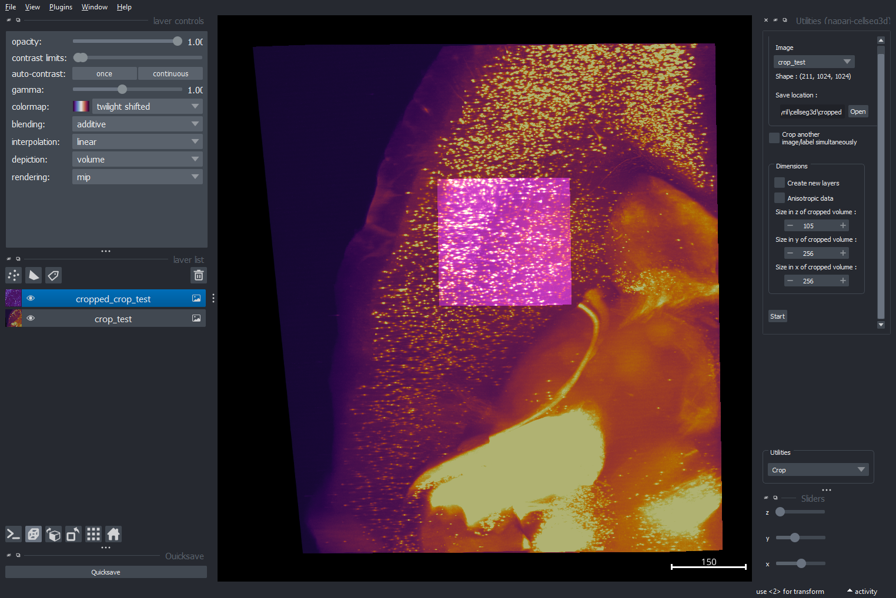
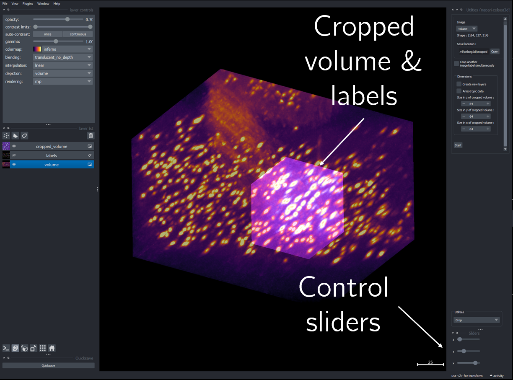

.. _cropping_module_guide:

Cropping✂️
==========

    Layout of the cropping module

**Cropping** allows you to crop your volumes and labels dynamically,
by selecting a fixed size volume and moving it around the image.

To access it:
    - Navigate to **`Plugins -> Utilities`**.
    - Choose **`Crop`** from the bottom menu.

Once cropped, you have multiple options to save the volumes and labels:
    - Use the **`Quicksave`** button in Napari.
    - Select the layer and then go to **`File` -> `Save selected layers`**.
    - With the correct layer highlighted, simply press **`CTRL + S`**.

.. Note::
    For more on utility tools, see :doc:`utils_module_guide`.

Launching the cropping process
------------------------------
1. From the layer selection dropdown menu, select your image. If you want to crop a second image with the same dimensions simultaneously,
check the **`Crop another image simultaneously`** option and then select the relevant layer.

2. Define your desired cropped volume size. This size will remain fixed for the duration of the session.
To update the size, you will need to restart the process.

3. You can also correct the anisotropy, if you work with anisotropic data: simply set your microscope's resolution in microns.

.. important::
    This will scale the image in the viewer, but saved images will **still be anisotropic.** To resize your image, see :doc:`utils_module_guide`.

4. Press **`Start`** to start the cropping process.
If you'd like to modify the volume size, change the parameters as described and hit **`Start`** again.

Creating new layers
-------------------
To "zoom in" on a specific portion of your volume:

- Use the `Create new layers` checkbox next time you hit `Start`. This option lets you make an additional cropping layer instead of replacing the current one.

- This way, you can first select your region of interest by using the tool as described above, then enable the option, select the cropped region produced before as the input layer, and define a smaller crop size in order to further crop within your region of interest.

Interface & functionalities
---------------------------

    Example of the cropping process interface.

Once you have launched the review process, you will gain control over three sliders, which will let
you to **adjust the position** of the cropped volumes and labels in the x,y and z positions.

.. note::
    * If your **cropped volume isn't visible**, consider changing the **colormap** of the image and the cropped
      volume to improve their visibility.
    * You may want to adjust the **opacity** and **contrast thresholds** depending on your image.
    * If the image appears empty:
        - Right-click on the contrast limits sliders.
        - Select **`Full Range`** and then **`Reset`**.

Saving your cropped volume
--------------------------
- When you are done, you can save the cropped volume and labels directly with the **`Quicksave`** button located at the bottom left. Your work will be saved in the same folder as the image you choose.

- If you want more options (name, format) when saving:
    - Select the desired layer.
    - Navigate in the napari menu to **`File -> Save selected layer`**.
    - Press **`CTRL+S`** once you have selected the correct layer.

Source code
-------------------------------------------------

* :doc:`../code/_autosummary/napari_cellseg3d.code_plugins.plugin_crop`
* :doc:`../code/_autosummary/napari_cellseg3d.code_plugins.plugin_base`
