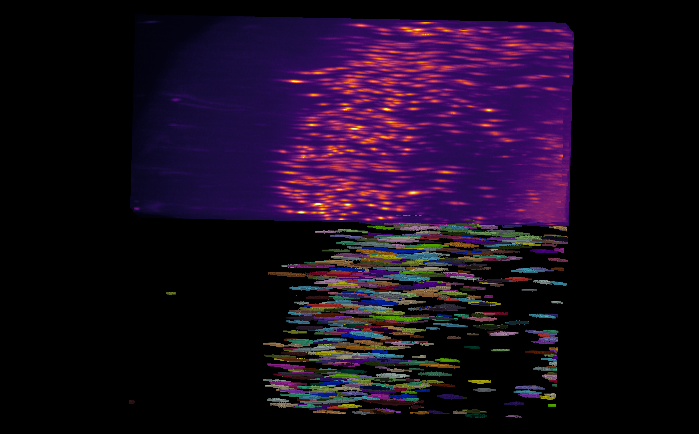
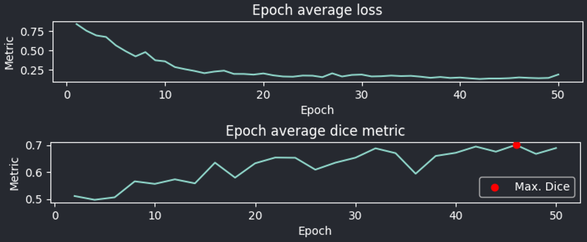

.. _detailed_walkthrough:

Walkthrough - Supervised learning
==========================================

This guide will show you step-by-step how to use the plugin's workflow, beginning with human annotated datasets, to generating predictions on new volumes.

Setting up images and labels
----------------------------

CellSeg3D is designed for cleared-brain tissue data (collected using mesoSPIM ligthsheet systems).
Here's what we offer:

- **Ready-to-use deep learning models**: Optimised for whole-neuron imaging in the cortex.
- **MONAI models support**
- **Trailmap in Pytorch**: We've integrated TRAILMAP into PyTorch, harnessing mesoSPIM data.

Ready to get started? Ensure you have part of a cleared brain from mesoSPIM imaging as a big **.tif** file and its label at hand.

For quick model checks, check the "Inference" sections in our docs.

   Example of an anisotropic volume (i.e., often times the z resolution is not the same as x and y) and its associated labels.

.. note::
  This guide emphasizes a human-in-the-loop review of labels.
  If you need to start labeling volumes from scratch or correct initial labels, we recommend consulting the sections on :ref:`Review<walkthrough_reviewing>` section right after :ref:`Cropping <walkthrough_cropping>`.

Launching the plugin
************************

See `Usage section <https://adaptivemotorcontrollab.github.io/CellSeg3D/welcome.html#usage>`_ for instructions on launching the plugin.

Cropping
*********
.. _walkthrough_cropping:

To reduce memory requirements and build a dataset from a single, large volume,
you can use the **cropping** tool to extract multiple smaller images from a large volume for training.

1. Load your primary image and any corresponding labels. If cropping labels, ensure "Crop labels simultaneously" is selected.
2. Choose your desired volume size for extraction.

.. note::
   For optimal training, opt for cubic images set to powers of two : a default of :math:`64^3` should be a good start if you're unsure.
   Stick to this size across your dataset.
   However, if specific regions need varied sizes, you can compensate for it during training.
   When running inference on multiple images in a folder, try to maintain size uniformity.

1. Use the slider to choose the exact areas you want to extract.
2. Options for saving:
   - Use the **quicksave** feature
   - Or, select the intended layer and press **`CTRL+S`**

.. figure:: ../images/cropping_process_example.png
   :align: center

   Cropping module layout

Label conversion utility
************************

Assuming you have instance labels, you'll need to convert them to semantic labels before using them for training.

.. note::
   Instance labels used in training will be converted to semantic labels automatically, but this might not always result in the desired behavior.

Step-by-Step Instructions:
   1. Launch the *Convert* tab within Utilities.
   2. Specify your preferred output directory.
   3. Load the folder with your cropped volumes under **`Convert Folder`**.
   4. Click on **`Convert to semantic labels`**.

.. figure:: ../images/converted_labels.png
   :scale: 40 %
   :align: center

   Example of instance labels from above converted to semantic labels

To remove small objects, or to convert a single image, use the **`CTRL+O`** shortcut to open the image you wish to manipulate.
Then, select its corresponding layer, and start the process using layer-specific controls.

Models for object detection
---------------------------

Training Guide
**************

1. Preparation:

   - **Size**: Ensure that your images are appropriately sized. Please see the cropping section for guidelines.
   - **Data paths**: Input the paths for your images and labels. Additionally, specify an output location where the results will be saved.

2. Training Options and Features:

   - **Transfer weights**: While we offer pre-trained weights designed specifically for cleared brain tissue imagery, the flexibility to incorporate your own weights exists. If you're choosing the latter, ensure they are compatible with the model you selected (see : :ref:`custom_model_guide`).
   - **Validation proportion**: Decide on a specific percentage to determine the number of images which will be used for training versus validation. While validation can in theory work with even one image, the richness of data in validation will greatly improve model's performance. Use 90% only if you have a very small dataset (less than 5 images).
   - **Save as zip** : Copies the results in a zip archive for easier transfer.

3. Data augmentation:

   * If you have cropped cubic images with a power of two as the edge length, you do not need to extract patches, your images are usable as is.
   * However, if you are using larger images or with variable sizes, you can use this option to auto-extract smaller patches that will be automatically padded back to a power of two no matter the size you choose. For optimal performance, make sure to use a value close or equal to a power of two still, such as 64 or 120.

.. important::
    Using a large value for the size will cause memory issues. If this happens, restart the work with smaller volumes.

You also have the option to use data augmentation, which can improve performance and generalization.
In most cases this should left enabled.

1. Model selection: You can choose from a variety of models, based on the needs of your project:

   * **SegResNet** is a lightweight model (low memory requirements) from MONAI originally designed for 3D fMRI data.
   * **VNet** is a larger (than SegResNet) CNN from MONAI designed for medical image segmentation.
   * **TRAILMAP** is our implementation in PyTorch additionally trained on mouse cortical neural nuclei from mesoSPIM data.
   * **SwinUNetR** is a MONAI implementation of the SwinUNetR model. It is costly in compute and memory, but can achieve high performance.
   * **WNet3D** is our extension of an unsupervised model, which can be used to produce segmentation without labels. See :ref:`training_wnet` for more information.

* **The loss** : For 3D volume object detection, the Dice or Dice-focal Loss is the most efficient.

* **Batch size** : Chose a value suited to your memory. To avoid memory issues, leave it to one.

* **Learning rate** : Default to 1e-3 unless using specific weights, then adjust.

* **Number of epochs** : More epochs mean longer training but potentially better results. Begin with 40 epochs.

.. note::
    During training, you can monitor the process using plots : ideally the validation curve should ascend
    whereas the loss curve should descend. If the validation starts lowering after reaching a maximum, but the loss still decreases,
    it could indicate over-fitting, which will negatively impact generalization for the given weights.
    You might want use weights generated from the epoch with the maximum validation score if that is the case.

   Plots displayed by the training module after 40 epochs

* **Validation interval** : Dictates how frequently the model halts training to validate its current performance. If the value is e.g. 2, the training will stop every 2 epochs to perform validation and save the results if the score is better than the previous one.Pausing frequently (smaller value) ensures you capture the best model state more often. Yet, it extends the overall training time.

* **Deterministic training** : To guarantee reproducibility in results across training sessions. When deterministic training is enabled, remember the seed you've inputted. Using the same seed with the same model, images, and parameters should consistently yield similar results. See `MONAI deterministic training`_.

.. _MONAI deterministic training: https://docs.monai.io/en/stable/utils.html#module-monai.utils.misc

Once you set all these parameters, you can start the training. You can monitor progress with the plots; should you want to stop
the training you can do so anytime  by pressing the **Start** button again, whose text should change to **Click to stop**.

In the results folder, you will have access to the weights from training (**.pth** files),
which you can then use in inference.

Inference
*********

To start, choose the folder with images ready for inference, and the location you want to store your results.

Then, select the model you trained (see note below for SegResNet), and load your weights from training.

.. note::
    If you already trained a SegResNet, set the counter below the model choice to the size of the images you trained the model on.
    (Either use the size of the image itself if you did not extract patches, or the size of the nearest superior power of two of the patches you extracted)

    Example :

    * If you used :math:`64^3` whole volumes to train the model, enter :math:`64` in the counter.
    * If you extracted :math:`120^3` patches from larger images, enter :math:`128`

Use **window inference** when the size of your images is substantial. Ensure the size aligns with your images, as under-sizing might impact the quality of your results. You can keep the dataset on the CPU to reduce memory usage, but this might decelerate the process.

If you have **anisotropic volumes**, you can compensate by entering the resolution of your microscope.

By default, inference will calculate and display probability maps (values between 0 and 1). For a segmentation output with distinct labels, modify the threshold to the desired probability.

If instead you'd prefer instance labels, you can enable instance segmentation and select :

* The method:

  * **Voronoi-Otsu** : objects will be assigned an ID by using the Voronoi diagram of the centroids of each object, then using Otsu's thresholding to separate them. The sigmas should roughly match cell diameter.
  * **Connected components** : Every seperated object above the threshold will be labeled as an instance.
  * **Watershed** : Assigns identifiers to objects based on the gradient probability at the their center (set the threshold to a decently high value).

* **The threshold** : Objects above this threshold will be retained as single instances.
* **Small object removal** : To filter small artifacts; all objects below this volume in pixels will be removed.

Using instance segmentation, you can also analyze the results by checking the *Save stats to CSV* option.

This will compute :

* The volume of each cell in pixels.
* The centroid coordinates in :math:`X,Y,Z`.
* The sphericity of each cell.
* The original size of the image.
* The total volume in pixels.
* The total volume occupied by objects.
* The ratio of :math:`\frac {Volume_{label}} {Volume_{total}}`.
* The total number of unique object instance.

To visualise some of the results when running on a folder, you can leave the **View results in napari** option checked.

.. note::
    Too plot your results, check out the `provided notebooks`_

.. _provided notebooks: https://github.com/AdaptiveMotorControlLab/CellSeg3D/tree/main/notebooks

You can then launch inference and the results will be saved in your specified folder.

.. figure:::: ../image/inference_results_example.png

   Example of results from inference with original volumes, as well as semantic and instance predictions.

Scoring, review, analysis
----------------------------

.. Using the metrics utility module, you can compare the model's predictions to any ground truth labels you might have.
    Simply provide your prediction and ground truth labels, and compute the results.
    A Dice metric of 1 indicates perfect matching, whereas a score of 0 indicates complete mismatch.
    Select which score **you consider as sub-optimal**, and all results below this will be **shown in napari**.
    If at any time the **orientation of your prediction labels changed compared to the ground truth**, check the
    "Find best orientation" option to compensate for it.

Labels review
************************
.. _walkthrough_reviewing:

Using the review module, you can correct the model's predictions.
Load your images and labels, and enter the name of the csv file, keeps tracking of the review process( it
records which slices have been checked or not and the time taken).

See the `napari tutorial on annotation`_ for instruction on correcting and adding labels.

.. _napari tutorial on annotation: https://napari.org/howtos/layers/labels.html#selecting-a-label

If you wish to see the surroundings of an object to ensure it should be labeled,
you can use **`Shift+Click`** on the location you wish to see; this will plot
the  surroundings of this location for easy viewing.

.. figure:: ../images/review_process_example.png
   :align: center

   Layout of the review module

Once you finish reviewing, press the **Not checked** button to switch the status to
**checked** and save the time spent in the csv file.

once satisfied with your review, press the **Save** button to record your work.

Analysis : Jupyter notebooks
*********************************

In the `notebooks folder of the repository`_, you can find notebooks for plotting
labels (full_plot.ipynb), and notebooks for plotting the inference results (csv_cell_plot.ipynb).

Simply enter your folder or csv file path and the notebooks will plot your results.
Make sure you have all required libraries installed and jupyter extensions set up as explained
for the plots to work.

.. figure:: ../images/stat_plots.png
   :align: center

   Example of the plot present in the notebooks.
   Coordinates are based on centroids, the size represents the volume, the color, and the sphericity.

.. _notebooks folder of the repository: https://github.com/AdaptiveMotorControlLab/CellSeg3D/tree/main/notebooks

With this complete, you can repeat the workflow as needed.
