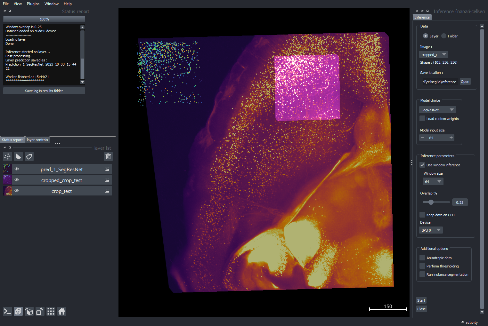
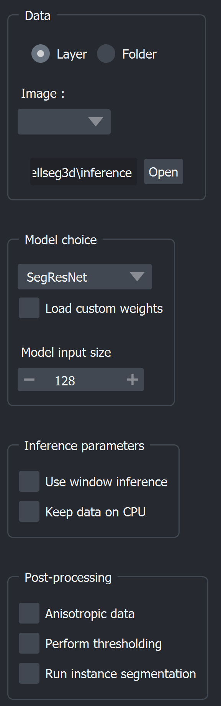
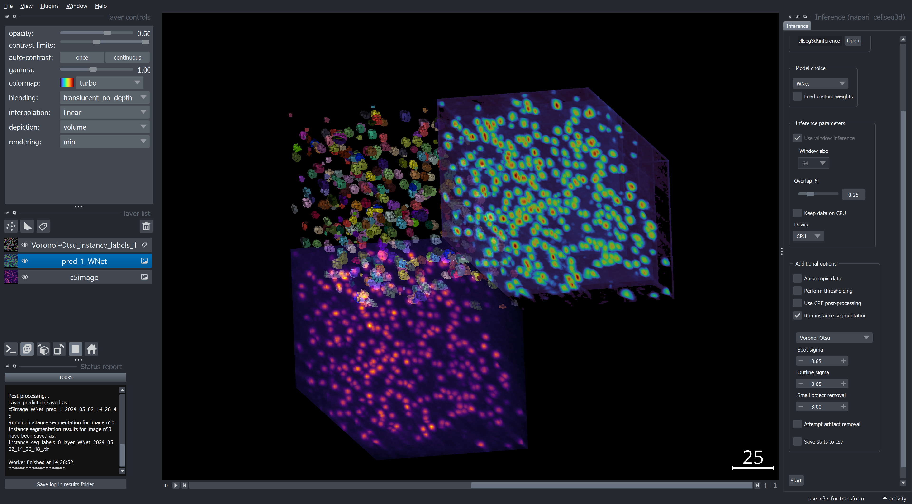

.. _inference_module_guide:

Inference📊
==============

    Layout of the inference module

**Inference** allows you to use pre-trained segmentation algorithms, written in Pytorch,
to automatically label cells in 3D volumes.

See `Usage section <https://adaptivemotorcontrollab.github.io/CellSeg3d/welcome.html#usage>`_ for instructions on launching the plugin.
See :ref:`training_module_guide` for instructions on training your own models before inference.

.. important::
    Currently, the module supports inference on **3D volumes**. When running on folders, make sure that your image folder
    only contains a set of **3D image files** saved with the **`.tif`** extension.
    Otherwise you can run inference directly on layers within napari. Stacks of 2D files can be loaded as 3D volumes in napari.

At present, the following pre-trained models are available :

==============   ================================================================================================
Model            Link to original paper
==============   ================================================================================================
SwinUNetR        `Swin Transformers for Semantic Segmentation of Brain Tumors in MRI Images`_
SegResNet        `3D MRI brain tumor segmentation using autoencoder regularization`_
WNet3D             `WNet3D, A Deep Model for Fully Unsupervised Image Segmentation`_
TRAILMAP_MS       An implementation of the `TRAILMAP project on GitHub`_ using `3DUNet for PyTorch`_
VNet             `Fully Convolutional Neural Networks for Volumetric Medical Image Segmentation`_
==============   ================================================================================================

.. _Fully Convolutional Neural Networks for Volumetric Medical Image Segmentation: https://arxiv.org/pdf/1606.04797.pdf
.. _3D MRI brain tumor segmentation using autoencoder regularization: https://arxiv.org/pdf/1810.11654.pdf
.. _TRAILMAP project on GitHub: https://github.com/AlbertPun/TRAILMAP
.. _3DUnet for Pytorch: https://github.com/wolny/pytorch-3dunet
.. _Swin Transformers for Semantic Segmentation of Brain Tumors in MRI Images: https://arxiv.org/abs/2201.01266
.. _WNet3D, A Deep Model for Fully Unsupervised Image Segmentation: https://arxiv.org/abs/1711.08506

.. note::
    For WNet3D-specific instruction please refer to the appropriate section below.

Interface and functionalities
-----------------------------

    Inference parameters

* **Loading data** :

  | When launching the module, select either an **image layer** or an **image folder** containing the 3D volumes you wish to label.
  | When loading from folder : All images with the chosen extension ( currently **.tif**) will be labeled.
  | Specify an **output folder**, where the labelled results will be saved.

* **Model selection** :

  | You can then choose from the listed **models** for inference.
  | You may also **load custom weights** rather than the pre-trained ones. Make sure these weights are **compatible** (e.g. produced from the training module for the same model).
  | For SegResNet or SwinUNetR with custom weights, you will have to provide the size of images it was trained on to ensure compatibility. (See note below)

.. note::
    Currently the SegResNet and SwinUNetR models require you to provide the size of the images the model was trained with.
    Provided weights use a size of 64, please leave it on the default value if you're not using custom weights.

* **Inference parameters** :

  * **Window inference**: You can choose to use inference on the entire image at once (disabled) or divide the image (enabled) on smaller chunks, based on your memory constraints.
  * **Window overlap**: Define the overlap between windows to reduce border effects;
    recommended values are 0.1-0.3 for 3D inference.
  * **Keep on CPU**: You can choose to keep the dataset in RAM rather than VRAM to avoid running out of VRAM if you have several images.
  * **Device Selection**: You can choose to run inference on either CPU or GPU. A GPU is recommended for faster inference.

* **Anisotropy** :

 For **anisotropic images** you may set the **resolution of your volume in micron**, to view and save the results without anisotropy.

* **Thresholding** :

  You can perform thresholding to **binarize your labels**.
  All values below the **confidence threshold** will be set to 0.

.. hint::
  It is recommended to first run without thresholding. You can then use the napari contrast limits to find a good threshold value,
  and run inference later with your chosen threshold.

* **Instance segmentation** :

  | You can convert the semantic segmentation into instance labels by using either the `Voronoi-Otsu`_, `Watershed`_ or `Connected Components`_ method, as detailed in :ref:`utils_module_guide`.
  | Instance labels will be saved (and shown if applicable) separately from other results.

.. _Watershed: https://scikit-image.org/docs/dev/auto_examples/segmentation/plot_watershed.html
.. _Connected Components: https://scikit-image.org/docs/dev/api/skimage.measure.html#skimage.measure.label
.. _Voronoi-Otsu: https://haesleinhuepf.github.io/BioImageAnalysisNotebooks/20_image_segmentation/11_voronoi_otsu_labeling.html

* **Computing objects statistics** :

  You can choose to compute various stats from the labels and save them to a **`.csv`** file for later use.
  Statistics include individual object details and general metrics.
  For each object :

  * Object volume (pixels)
  * :math:`X,Y,Z` coordinates of the centroid
  * Sphericity

  Global metrics :

  * Image size
  * Total image volume (pixels)
  * Total object (labeled) volume (pixels)
  * Filling ratio (fraction of the volume that is labeled)
  * The number of labeled objects

* **Display options** :

  When running inference on a folder, you can choose to display the results in napari.
  If selected, you may choose the display quantity, and whether to display the original image alongside the results.

Once you are ready, hit the **`Start`** button to begin inference.
The log will keep you updated on the progress.

.. note::
   You can save the log to keep track of the parameters you ran inference with.

Once the job has finished, the semantic segmentation will be saved in the output folder.

| The files will be saved using the following format :
| ``{original_name}_{model}_{date & time}_pred{id}.file_ext``

.. hint::
    | Adjust **colormap** or **contrast** to enhance the visibility of labels.
    | Experiment with **3D view** and **grid mode** in napari when checking your results.

Plotting results
----------------

In the ``notebooks`` folder you will find a plotting guide for cell statistics derived from the inference module.
Simply load the csv file in the notebook and use the provided functions to plot the desired statistics.

Unsupervised model - WNet3D
--------------------------------

| The `WNet3D model` is a fully self-supervised model used to segment images without any labels.
| It functions similarly to the above models, with a few notable differences.

.. _WNet3D model: https://arxiv.org/abs/1711.08506

.. note::
    Our provided, pre-trained model uses an input size of 64x64x64. As such, window inference is always enabled
    and set to 64. If you want to use a different size, you will have to train your own model using the options listed in :ref:`training_wnet`.
    Additionally, window inference and the number of classes are for now fixed in the plugin to support our pre-trained model only (2 classes and window size 64).

For the best inference performance, the model should be retrained on images of the same modality as the ones you want to segment.
Please see :ref:`training_wnet` for more details on how to train your own model.

.. hint::
  | WNet3D, as an unsupervised model, may not always output the background and foreground class in the same dimension, as this depends on initial conditions.
  | This might cause the result from inference to appear densely populated or empty.
  | The plugin will automatically attempt to show the foreground class, but this might not always succeed.
  | If the displayed output seems dominated by the background, you can manually adjust the visible class. To do this, **use the slider positioned at the bottom of the napari window**.

    Example of inference with WNet3D on a 3D volume

Source code
--------------------------------
* :doc:`../code/_autosummary/napari_cellseg3d.code_plugins.plugin_model_inference`
* :doc:`../code/_autosummary/napari_cellseg3d.code_models.worker_inference`
* :doc:`../code/_autosummary/napari_cellseg3d.code_models.models`
