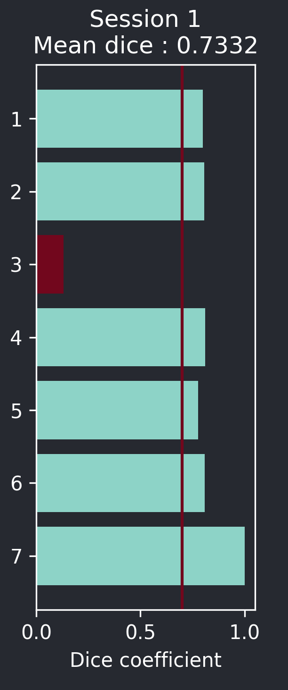

.. _metrics_module_guide:

Metrics utility guide 📈
========================

   Dice metric plot result

This tool computes the Dice coefficient, a similarity measure, between two sets of label folders.
Ranges from 0 (no similarity) to 1 (perfect similarity).

The Dice coefficient is defined as :

.. math:: \frac {2|X \cap Y|} {|X|+|Y|}

Required parameters:
--------------------

* Ground Truth Labels folder
* Prediction Labels folder
* Threshold for sufficient score. Pairs below this score are highlighted in the viewer and marked in red on the plot.
* Whether to automatically determine the best orientation for the computation by rotating and flipping;
  useful if your images have varied orientation.

.. note::
    - The tool might rotate and flip images randomly to find the best Dice coefficient. If you have small images with a large number of        labels, this might lead to metric inaccuracies. Low score images might be in the wrong orientation when displayed for comparison.
    - This tool assumes that **predictions are padded to a power of two.** Ground truth labels can be smaller, as they will be padded to match the prediction size.
    - Your files should have names that can be sorted numerically; please ensure that each ground truth label has a matching prediction        label.

To begin, press the **`Compute Dice`** button. This will plot the Dice score for each ground truth-prediction labels pair.
Pairs below the threshold will be displayed on the viewer for verification, ground truth appears in **blue**, and low score predictions in **red**.

Source code
-------------------------------------------------

* :doc:`../code/plugin_base`
* :doc:`../code/plugin_metrics`
