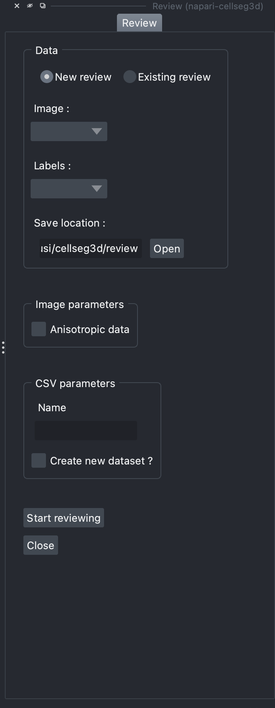

.. _review_module_guide:

Labeling🔍
=================================

    Layout of the review module

**Labeling** allows you to inspect your labels, which may be manually created or predicted by a model, and make necessary corrections.
The system will save the updated status of each file in a csv file.
Additionally, the time taken per slice review is logged, enabling efficient monitoring.

See `Usage section <https://adaptivemotorcontrollab.github.io/CellSeg3d/welcome.html#usage>`_ for instructions on launching the plugin.

Launching the review process
---------------------------------

1. **Data paths:**
         - *Starting a new review:* Choose the **`New review`** option, and select the corresponding layers within Napari.
         - *Continuing an existing review:* Select the **`Existing review`** option, and choose the folder that contains the image, labels, and CSV file.

.. note::
    Cellseg3D supports 3D **`.tif`** files at the moment.
    If you have a stack, open it as a folder in Napari, then save it as a single **`.tif`** file.

2. **Managing anisotropic data:**
    Check this option to scale your images to visually remove the anisotropy, so as to make review easier.

.. note::
    The results will be saved as anisotropic images. If you want to resize them, check the :doc:`utils_module_guide`

3. **CSV file naming:**
        - Select a name for your review, which will be used for the CSV file that logs the status of each slice.
        - If an identical CSV file already exists, it will be used. If not, a new one will be generated.
        - If you choose to create a new dataset, a new CSV will always be created. If multiple copies already exist, a sequential number will be appended to the new file's name.

4. **Beginning the labeling:**
    Press **`Start reviewing`** once you are ready to start the review process.

.. warning::
    Starting a review session opens a new window and closes the current one.
    Make sure you have saved your work before starting the review session.

Interface & functionalities
---------------------------

.. figure:: ../images/review_process_example.png
    :align: center

    Interface for the labeling process.

Once you have launched the labeling process, you will have access to the following functionalities:

.. hlist::
   :columns: 1

   * A dialog to choose where to save the verified and/or corrected annotations, and a button to save the labels. They will be using the provided file format.
   * A button to update the status of the slice in the csv file (in this case : checked/not checked)
   * A graph with projections in the x-y, y-z and x-z planes, to allow the reviewer to better understand the context of the volume and decide whether the image should be labeled or not. Use **shift-click** anywhere on the image or label layer to update the plot to the location being reviewed.

To recap, you can check your labels, correct them, save them and keep track of which slices have been checked or not.

.. note::
    You can find the csv file containing the annotation status **in the same folder as the labels**.
    It will also keep track of the time taken to review each slice, which can be useful to monitor the progress of the review.

Source code
-------------------------------------------------

* :doc:`../code/_autosummary/napari_cellseg3d.code_plugins.plugin_review`
* :doc:`../code/_autosummary/napari_cellseg3d.code_plugins.plugin_review_dock`
* :doc:`../code/_autosummary/napari_cellseg3d.code_plugins.plugin_base`
