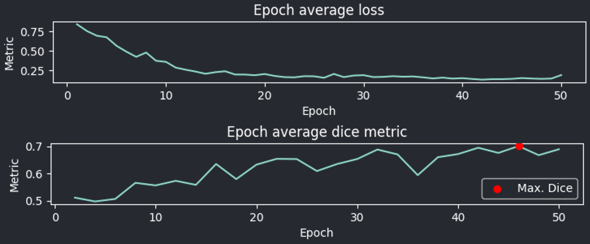

.. _training_module_guide:

Training module guide
----------------------------------------------

Supervised models
==============================================

This module allows you to train models for cell segmentation.
Pre-trained weights are automatically downloaded when needed.

.. important::
    Currently, only inference on **3D volumes is supported**. Your image and label folders should both contain a set of
    **3D image files**, currently either **.tif** or **.tiff**. Loading a folder of 2D images as a stack is supported only if
    you use napari to load the stack as a 3D image, and save it as a 3D image file.

Currently, the following pre-defined models are available :

==============   ================================================================================================
Model            Link to original paper
==============   ================================================================================================
VNet             `Fully Convolutional Neural Networks for Volumetric Medical Image Segmentation`_
SegResNet        `3D MRI brain tumor segmentation using autoencoder regularization`_
TRAILMAP_MS       An implementation of the `TRAILMAP project on GitHub`_ using `3DUNet for PyTorch`_
SwinUNetR         `Swin UNETR, Swin Transformers for Semantic Segmentation of Brain Tumors in MRI Images`_
==============   ================================================================================================

.. _Fully Convolutional Neural Networks for Volumetric Medical Image Segmentation: https://arxiv.org/pdf/1606.04797.pdf
.. _3D MRI brain tumor segmentation using autoencoder regularization: https://arxiv.org/pdf/1810.11654.pdf
.. _TRAILMAP project on GitHub: https://github.com/AlbertPun/TRAILMAP
.. _3DUnet for Pytorch: https://github.com/wolny/pytorch-3dunet
.. _Swin UNETR, Swin Transformers for Semantic Segmentation of Brain Tumors in MRI Images: https://arxiv.org/abs/2201.01266

.. important::
    | The machine learning models used by this program require all images of a dataset to be of the same size.
    | Please ensure that all the images you are loading are of the **same size**, or to use the **"extract patches" (in augmentation tab)** with an appropriately small size to ensure all images being used by the model are of a workable size.
    | If you need to fragment a large file into cubes, please use the Fragment utility in :ref:`utils_module_guide`.

The training module is comprised of several tabs :

1) **Model** tab
___________________

* Select which model to use (see above table)
* Whether to use pre-trained weights

.. note::
    | The model will be initialized with our pre-trained weights,
    | possibly improving performance (via transfer learning).
    | Custom weights may also be loaded;
    | simply ensure they are compatible with the model.

* Select the device to use for training (CPU or GPU if CUDA is available)

2) **Data** tab
___________________

* The path to the images folder (3D image files)
* The path to the labels folder (3D image files)
* The path to the results folder
* Whether to save a copy of results as a zip file
* Whether to use images "as is" (**requires all images to be of the same size and cubic**) or extract patches

.. important::
    | **All image sizes used should be as close to a power of two as possible, or equal to a power of two.**
    | Images are automatically padded; a 64 pixels cube will be used as is, but a 65 pixel cube will be padded up to 128 pixels, resulting in much higher memory use.

* If you're extracting patches :

    * The size of patches to be extracted (ideally, please use a value **close or equal to a power of two**, such as 120 or 60 to ensure correct size. See above note.)
    * The number of samples to extract from each of your images. A larger number will likely mean better performances, but longer training and larger memory usage

.. note:: If you're using a single image (preferably large) it is recommended to enable patch extraction

* Whether to perform data augmentation or not (elastic deforms, intensity shifts. random flipping,etc)
* The **training versus validation proportion**; you may change this depending on your dataset

3) **Training** tab
____________________

* The **loss function** used for training (see table below)
* The **batch size** : set to larger values for quicker training and possibly better performance but increased memory usage
* The **learning rate** of the optimizer. Setting it to a lower value if you're using pre-trained weights can improve performance
* The **number of epochs** (a possibility is to start with 100 epochs, and decrease or increase depending on convergence speed)
* The **validation epoch interval** (if set to two, the module will use the validation dataset to evaluate the model with the dice metric every two epochs)
* The **scheduler patience**, which is the number of epochs at a plateau that is waited for before the learning rate is reduced
* The **scheduler factor**, which is the factor by which to reduce the learning rate once a plateau is reached
* Whether to use **deterministic training**, and which seed to use.

.. note::
    If the dice metric is better on a given validation interval, the model weights will be saved in the results folder.

The available loss functions are :

========================  ================================================================================================
Function                  Reference
========================  ================================================================================================
Dice loss                 `Dice Loss from MONAI`_ with ``sigmoid=true``
Generalized Dice loss     `Generalized dice Loss from MONAI`_ with ``sigmoid=true``
Dice-CE loss              `Dice-CrossEntropy Loss from MONAI`_ with ``sigmoid=true``
Tversky loss              `Tversky Loss from MONAI`_ with ``sigmoid=true``
========================  ================================================================================================

.. _Dice Loss from MONAI: https://docs.monai.io/en/stable/losses.html#diceloss
.. _Focal Loss from MONAI: https://docs.monai.io/en/stable/losses.html#focalloss
.. _Dice-focal Loss from MONAI: https://docs.monai.io/en/stable/losses.html#dicefocalloss
.. _Generalized dice Loss from MONAI: https://docs.monai.io/en/stable/losses.html#generalizeddiceloss
.. _Dice-CrossEntropy Loss from MONAI: https://docs.monai.io/en/stable/losses.html#diceceloss
.. _Tversky Loss from MONAI: https://docs.monai.io/en/stable/losses.html#tverskyloss

4) **Advanced** tab
___________________

This tab is only available with WNet training. Please see the :ref:`WNet parameters list <When using the WNet training module>` section for more information.

Running the training
_____________________

Once you are ready, press the Start button to begin training. The module will automatically train the model.

.. note::
    You can stop the training at any time by clicking on the start button again.
    **The training will stop after the next batch has been processed, and will try to save the model. Please note that results might be incomplete if you stop the training this way.**

After a minimum of two validations steps have been performed (which depends on the interval you set),
the training loss values and validation metrics will be plotted
and shown on napari every time a validation step completes.
This plot is automatically saved each time validation is performed and the final version is stored separately in the results folder.
The model's inputs (image, label) and outputs (raw & binarized) will also be displayed in the napari viewer.

   Example of plots displayed by the training module after 40 epochs

.. note::
    You can save the log with the button underneath it to record the losses and validation metrics numerical values at each step. This log is autosaved as well when training completes.

Unsupervised model
==============================================

The training of our custom WNet implementation is now available as part of the Training module.

Please see the :ref:`training_wnet` section for more information.

WandB integration (optional)
==============================================

.. important::
    The WandB integration is currently only available for WNet training.
    Other models may be supported in the future.

The training module can be used with the `Weights and Biases <https://wandb.ai/site>`_ platform to track your training metrics and results.
To use wandb, you will need to create an account on their website and install the wandb python package.

* Install :
.. code-block::

    pip install wandb

* Alternatively, you can install it as an optional requirement with the following command :
.. code-block::

    pip install napari-cellseg3d[wandb]

* Connect your account :

.. code-block::

    wandb login

Your API key will be asked. You can find it on your account page on the website.
Once this is done, your WNet runs will be automatically logged to WandB.
You can find them under **CellSeg3D WNet** on your project page.

Source code
==============================================
* :doc:`../code/plugin_model_training`
* :doc:`../code/model_framework`
* :doc:`../code/workers`
