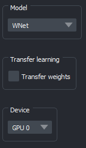
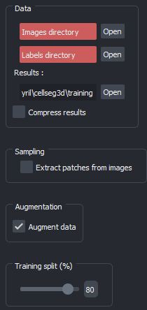

.. _training_module_guide:

Training 🏋️‍♂️
-----------

.. figure:: ../images/plugin_train.png
    :align: center

    Layout of the training module

Supervised models
=================

**Training** allows you to train models for cell segmentation.
Whenever necessary, pre-trained weights will be automatically downloaded and integrated.

.. important::
    At present, only inference on **3D volumes is supported**. Ensure that both your image and label folders contain a set of
    **3D image files**, in either **`.tif`** or **`.tiff`** format. Loading a folder of 2D images as a stack is supported only if
    you use napari to load the stack as a 3D image, and save it as a 3D image file.

Currently, the systems offers the following pre-defined models:

==============   ================================================================================================
Model            Link to original paper
==============   ================================================================================================
SegResNet        `3D MRI brain tumor segmentation using autoencoder regularization`_
SwinUNetR         `Swin UNETR, Swin Transformers for Semantic Segmentation of Brain Tumors in MRI Images`_
WNet             `WNet, A Deep Model for Fully Unsupervised Image Segmentation`_
TRAILMAP_MS       An implementation of the `TRAILMAP project on GitHub`_ using `3DUNet for PyTorch`_
VNet             `Fully Convolutional Neural Networks for Volumetric Medical Image Segmentation`_
==============   ================================================================================================

.. _Fully Convolutional Neural Networks for Volumetric Medical Image Segmentation: https://arxiv.org/pdf/1606.04797.pdf
.. _3D MRI brain tumor segmentation using autoencoder regularization: https://arxiv.org/pdf/1810.11654.pdf
.. _TRAILMAP project on GitHub: https://github.com/AlbertPun/TRAILMAP
.. _3DUnet for Pytorch: https://github.com/wolny/pytorch-3dunet
.. _Swin UNETR, Swin Transformers for Semantic Segmentation of Brain Tumors in MRI Images: https://arxiv.org/abs/2201.01266
.. _WNet, A Deep Model for Fully Unsupervised Image Segmentation: https://arxiv.org/abs/1711.08506

.. important:: 
    For the optimal performance of the machine learning models within this program, it is crucial that all images in a dataset have the same dimensions. Before starting loading, please ensure that all images are of the **same size**. If there is a size variance, you can use the **`extract patches`"** option located under the augmentation tab. This will let you define a redused, consistent size for all the images. If you need to fragment a large file into cubes, please refer to the Fragment utility in :ref:`utils_module_guide`.

The training module is comprised of several tabs :

1) **Model** tab
___________________

   Model tab

* Select which model to use (see table above).
* Decide on using pre-trained weights.

.. note::
    The model will be initialized with our pre-trained weights,
    possibly improving performance via transfer learning.
    Custom weights may also be loaded;
    simply ensure they are compatible with the chosen model.

* Select between CPU and GPU (if CUDA is available).

2) **Data** tab
___________________

   Data tab

For Supervised Models:
**********************
1. **Paths**:
    - Image Folder (3D image files)
    - Labels Folder (3D image files)
    - Results Folder

2. **Options**: 
    - Save a copy of results as a **`zip`** file
    - Either use images "as is" (requires uniform size and cubic volume) or extract patches.

.. note::
    Preferably, the image dimensions should be equal to a power of two. Images are automatically padded; a 64 pixels cube will be used as is, while a 65 pixel cube will be padded up to 128 pixels, resulting in much higher memory consumption.

3. If you're extracting patches:
    - Define patches (ideally, please use a value close or equal to a power of two. See above note.)
    - Decide on the number of samples to extract from each image. A larger number will likely improve performances, but will also extend training time and increase memory usage.

If you're using a single image (preferably large) it is recommended to enable patch extraction.

4. Decide on executing data augmentation (elastic deforms, intensity shifts. random flipping,etc).
5. Define the training versus validation proportion according to your dataset.

For Unsupervised models
***********************
1. **Paths**:
    - Training Images Folder (3D image files)
    - Validation Images Folder (3D image files - **OPTIONAL**)
    - Validation Labels Folder (3D image files - **OPTIONAL**)
    - Results Folder

2. **Options**: 
    - Save a copy of results as a **`zip`** file
    - Either use images "as is" (requires uniform size and cubic volume) or extract patches.

3. Decide on executing data augmentation (elastic deforms, intensity shifts. random flipping,etc).

3) **Training** tab
____________________

.. figure:: ../images/training_tab_3.png
   :align: right

   Training tab
**TIP:** Here are all the parameters you can adjust:

* **loss function** : there are four available loss functions you can choose from for your training
    - [Dice loss](https://docs.monai.io/en/stable/losses.html#diceloss)
    - [Generalised Dice loss](https://docs.monai.io/en/stable/losses.html#generalizeddiceloss)
    - [Dice-CE loss](https://docs.monai.io/en/stable/losses.html#diceceloss)
    - [Tversky loss](https://docs.monai.io/en/stable/losses.html#tverskyloss)

* **batch size** : The batch size determines the number of samples that will be propagated through the network simultaneously. 
    Larger values can lead to quicker training and potentially better performance, but they will also require more memory. Adjust based on your system's capabilities.

* **learning rate of the optimizer** : This parameter controls the step size during the optimization process. 
    When using pre-trained weights, setting a lower learning rate can enhance performance.

* **number of epochs** : Refers to the number of times the algorithm will work through the entire training dataset. 
    A starting suggestion could be 100 epochs, but this might need to be adjusted based on the speed of convergence.

* **validation epoch interval** : Determines how frequently the model is evaluated on the validation dataset. 
    For instance, if set to two, the module will assess the model's performance using the dice metric every two epochs.

* **scheduler patience** : It defines how many epochs at a plateau the algorithm should wait before reducing the learning rate.

* **scheduler factor** : Once a plateau in model performance is detected, the learning rate is reduced by this factor.

* **deterministic training** :  If enabled, the training process becomes reproducible. You can also specify a seed value.

.. note::
    If the dice metric is better on a given validation interval, the model weights will be saved in the results folder.

4) **Advanced** tab
___________________

This tab is only available with WNet training. For more information please see the :ref:`WNet parameters list <When using the WNet training module>` section.

Running the training
____________________

Once you are ready, press the **`Start`** button to begin training. The module will automatically train the model.

.. note::
    You can stop the training process at any moment by clicking on the **`Start`** button again.
    **The training will stop after the processing the upcoming batch, and will try to save the model. However, be aware that interrupting can result in partial results.**

After conducting at least two validation steps (which depends on the interval you set),
the training loss values and validation metrics will be plotted
and shown on napari every time a validation step completes.
This plot is automatically saved each time validation is performed and the final version is stored separately in the results folder.
The model's inputs (image, label) and outputs (raw & binarized) will also be displayed in the napari viewer.

.. figure:: ../images/plots_train.png
   :align: center

   Example of plots displayed by the training module after 40 epochs

.. note::
    You can save the log with the button underneath it to record the losses and validation metrics numerical values at each step. This log is autosaved as well when training completes.

Unsupervised model
==============================================

The training of our custom WNet implementation is now available as part of the Training module.

Please see the :ref:`training_wnet` section for more information.

WandB integration (optional)
==============================================

.. _wandb_integration:

You can use the `Weights and Biases <https://wandb.ai/site>`_ platform to track your training metrics and results.

.. important::
    The WandB integration is available for WNet training.

To use wandb, you will need to create an account [HERE](https://wandb.ai/site) and install the wandb python package.

* Install :

.. code-block::

    pip install wandb

* Alternatively, you can install it as an optional requirement with the following command :

.. code-block::

    pip install napari-cellseg3d[wandb]

* Connect your account :

.. code-block::

    wandb login

Your API key will be asked. You can find it on your account page on the website.
Once this is done, your WNet runs will be automatically logged to WandB.
You can find them under **CellSeg3D WNet** on your project page.

Source code
==============================================
* :doc:`../code/_autosummary/napari_cellseg3d.code_plugins.plugin_model_training`
* :doc:`../code/_autosummary/napari_cellseg3d.code_models.worker_training`
* :doc:`../code/_autosummary/napari_cellseg3d.code_models.models`
