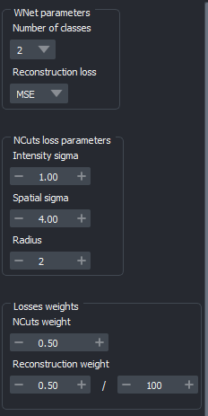

.. _training_wnet:

Advanced : WNet training
========================

This plugin provides a reimplemented, custom version of the WNet model from `WNet, A Deep Model for Fully Unsupervised Image Segmentation`_.

For training your model, you can choose among:

* Directly within the plugin
* The provided Jupyter notebook (locally)
* Our Colab notebook (inspired by https://github.com/HenriquesLab/ZeroCostDL4Mic)

Selecting training data
-------------------------

The WNet **does not require a large amount of data to train**, but **choosing the right data** to train this unsupervised model **is crucial**.

You may find below some guidelines, based on our own data and testing.

The WNet is designed to segment objects based on their brightness, and is particularly well-suited for images with a clear contrast between objects and background.

The WNet is not suitable for images with artifacts, therefore care should be taken that the images are clean and that the objects are at least somewhat distinguishable from the background.

.. important::
    For optimal performance, the following should be avoided for training:

    - Images with very large, bright regions
    - Almost-empty and empty images
    - Images with large empty regions or "holes"

    However, the model may be accomodate:

    - Uneven brightness distribution
    - Varied object shapes and radius
    - Noisy images
    - Uneven illumination across the image

For optimal results, during inference, images should be similar to those the model was trained on; however this is not a strict requirement.

You may also retrain from our pretrained model to your image dataset to help quickly reach good performance if, simply check "Use pre-trained weights" in the training module, and lower the learning rate.

.. note::
        - The WNet relies on brightness to distinguish objects from the background. For better results, use image regions with minimal artifacts. If you notice many artifacts, consider trying one of our supervised models (for lightsheet microscopy).
        - The model has two losses, the **`SoftNCut loss`**, which clusters pixels according to brightness, and a reconstruction loss, either **`Mean Square Error (MSE)`** or **`Binary Cross Entropy (BCE)`**.
        - For good performance, wait for the SoftNCut to reach a plateau; the reconstruction loss should also be decreasing overall, but this is generally less critical for segmentation performance.

Parameters
-------------

    Advanced tab

_`When using the WNet training module`, the **Advanced** tab contains a set of additional options:

- **Number of classes** : Dictates the segmentation classes (default is 2). Increasing the number of classes will result in a more progressive segmentation according to brightness; can be useful if you have "halos" around your objects, or to approximate boundary labels.
- **Reconstruction loss** : Choose between MSE or BCE (default is MSE). MSE is more precise but also sensitive to outliers; BCE is more robust against outliers at the cost of precision.

- NCuts parameters:
    - **Intensity sigma** : Standard deviation of the feature similarity term, focusing on brightness (default is 1).
    - **Spatial sigma** : Standard deviation for the spatial proximity term (default is 4).
    - **Radius** : Pixel radius for the loss computation (default is 2).

.. note::
    - The **Intensity Sigma** depends on image pixel values. The default of 1 is optimised for images being mapped between 0 and 100, which is done automatically by the plugin.
    - Raising the **Radius** might improve performance in certain cases, but will also greatly increase computation time.

- Weights for the sum of losses :
    - **NCuts weight** : Sets the weight of the NCuts loss (default is 0.5).
    - **Reconstruction weight** : Sets the weight for the reconstruction loss (default is 5*1e-3).

.. important::
    The weight of the reconstruction loss should be adjusted to ensure that both losses are balanced.

    This balance can be assessed using the live view of training outputs :
    if the NCuts loss is "taking over", causing the segmentation to only label very large, brighter versus dimmer regions, the reconstruction loss should be increased.

    This will help the model to focus on the details of the objects, rather than just the overall brightness of the volume.

Common issues troubleshooting
------------------------------

.. important::
    If you do not find a satisfactory answer here, please do not hesitate to `open an issue`_ on GitHub.

- **The NCuts loss "explodes" after a few epochs** : Lower the learning rate, for example start with a factor of two, then ten.

- **Reconstruction (decoder) performance is poor** : First, try increasing the weight of the reconstruction loss. If this is ineffective, switch to BCE loss and set the scaling factor of the reconstruction loss to 0.5, OR adjust the weight of the MSE loss.

- **Segmentation only separates the brighter versus dimmer regions** : Increase the weight of the reconstruction loss.

.. _WNet, A Deep Model for Fully Unsupervised Image Segmentation: https://arxiv.org/abs/1711.08506
.. _open an issue: https://github.com/AdaptiveMotorControlLab/CellSeg3d/issues
